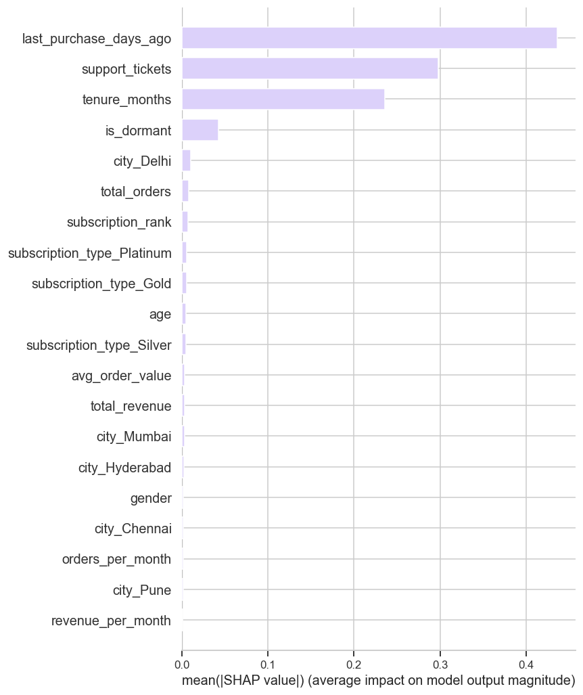

# E‑commerce Customer Churn — End‑to‑End ML + Dashboard

Predict customer churn on an Indian e‑commerce platform and surface the findings in an interactive **Tableau** dashboard. The project goes from raw CSV → EDA → feature engineering → model + SHAP → segmentation → dashboard, with an emphasis on **business‑readable insights** over leaderboard metrics.

> 🔗 **Tableau Public dashboard:** (https://public.tableau.com/views/Ecomerce_17799518692050/ChurnOverview)

> 🔗 **GitHub:** [trngphng1311/ecommerce-customer-churn](https://github.com/trngphng1311/ecommerce-customer-churn)

---

## 📊 Headline Findings

| | |
|---|---|
| **Total customers** | 40,000 |
| **Churn rate** | **37.2 %** (14,885 churned / 25,115 retained) |
| **Tuned threshold** | 0.462 — chosen on the precision–recall curve |
| **Model recall (churners)** | **71.5 %** |
| **Model precision (churners)** | 48.0 % |

### The story in one sentence
> **Churn is driven by *behaviour*, not demographics.** Churn rate is essentially flat (~36–38 %) across city, age band, and subscription tier — but **rises sharply for dormant customers** (no purchase in 90+ days). Retention effort should target *engagement* signals, not segment splits.

### Top churn drivers (mean |SHAP|, Logistic Regression)

| Rank | Feature | Mean \|SHAP\| |
|---:|---|---:|
| 1 | `last_purchase_days_ago` | **0.436** |
| 2 | `support_tickets` | 0.298 |
| 3 | `tenure_months` | 0.235 |
| 4 | `is_dormant` (>90 days) | 0.042 |
| 5 | `city_Delhi` | 0.011 |

Demographic features (city, age, gender, subscription tier) all have negligible SHAP magnitudes — the dashboard's "uniform churn across segments" pattern lines up with the model's own attributions.



---

## 🖼️ Dashboard (Tableau)

The Tableau workbook surfaces the **business‑facing** parts of the analysis. Sheets included:

- **Avg Revenue per Churner** (KPI tile)
- **Class Balance** — Churned vs Retained (donut)
- **Churn Rate by City** — horizontal bars with overall‑avg reference line
- **Churn Rate by Subscription Type** — Basic / Silver / Gold / Platinum
- **Churn Rate by Age Band**
- **Churn Rate by Tenure**
- **Active vs Dormant Churn** — *the strongest insight chart*
- **High‑Risk Watchlist** — actionable list of dormant, not‑yet‑churned customers, sorted by days inactive

**Two dashboards** assembled from these sheets:
1. **Churn Overview** — KPI + class balance + segment bars (the "where churn lives")
2. **Drivers & Action** — Active vs Dormant + watchlist + insight callout (the "why and what to do")

Open: `dashboard/tableau/Ecomerce.twb` in **Tableau Public** (Desktop). The workbook reads from `data/processed/dashboard.csv`.

---

## 🧪 Methodology

| Stage | Notebook | What happens |
|---|---|---|
| 1. EDA | `01_eda.ipynb` | Schema, dtypes, missingness, target balance, distributions, churn breakdowns, correlation heatmap |
| 2. Feature engineering | `02_feature_engineering.ipynb` | One‑hot encoding, derived ratios (`orders_per_month`, `revenue_per_month`, `tickets_per_order`, `total_revenue`), `is_dormant` flag, age / recency / tenure / ticket bands, scaled vs unscaled splits |
| 3. Modeling | `03_modeling.ipynb` | Logistic Regression (scaled) + tree‑based baselines. 80/20 stratified split, `class_weight='balanced'`. Threshold tuned on the PR curve to favour **recall** (missing a churner ≫ false alarm). SHAP for global + local explainability |

### Why recall over precision?
A missed churner is a lost customer lifetime — much more expensive than a false alarm that costs a single retention nudge. The 0.462 threshold trades 9 points of precision for ~15 points of recall vs the default 0.5.

---

## 📁 Project Structure

```
ecommerce-customer-churn/
├── data/
│   ├── raw/                       # Original 40k‑row CSV
│   └── processed/
│       ├── dashboard.csv          # Tableau input (committed)
│       └── shap_importance.csv    # Feature importance for dashboard (committed)
│       # large feature matrices are git‑ignored — regenerable from notebooks
├── notebooks/
│   ├── 01_eda.ipynb
│   ├── 02_feature_engineering.ipynb
│   └── 03_modeling.ipynb
├── outputs/
│   ├── figures/                   # All saved charts (SHAP, ROC, PR, confusion, …)
│   └── models/                    # Trained model, scaler, tuned threshold
├── dashboard/
│   ├── tableau/Ecomerce.twb       # Tableau workbook
│   └── DASHBOARD_GUIDE.md         # Brief guide to rebuild the dashboard
├── INSTRUCTIONS.md                # Brief end‑to‑end run guide
├── requirements.txt
├── .gitignore
└── README.md
```

---

## ⚙️ How to Reproduce

```bash
# 1. Clone
git clone https://github.com/trngphng1311/ecommerce-customer-churn.git
cd ecommerce-customer-churn

# 2. Environment
python3 -m venv .venv
source .venv/bin/activate
pip install -r requirements.txt
# macOS only: brew install libomp   # for XGBoost

# 3. Run notebooks in order
jupyter notebook
#   01_eda.ipynb  →  02_feature_engineering.ipynb  →  03_modeling.ipynb

# 4. Open the dashboard
#   Open dashboard/tableau/Ecomerce.twb in Tableau Public (Desktop)
```

The notebooks regenerate the feature matrices (`churn_features_scaled.csv`, `churn_features_unscaled.csv`, `churn_scored.csv`) which are git‑ignored to keep the repo lean.

---

## 🛠 Tech Stack

- **Python 3.12** — pandas, NumPy
- **scikit‑learn** — Logistic Regression, train/test split, metrics
- **XGBoost** — tree‑based baseline
- **SHAP** — global + per‑customer explainability
- **matplotlib / seaborn** — figure generation
- **Jupyter** — notebooks
- **Tableau Public** — dashboard

---

## ⚠️ Known Limitation

The `churn_probability` column exported to `dashboard.csv` is **incomplete** — ~33.5k of 40k customers have value 0 (likely the result of only scoring a holdout subset and left‑joining back with `fillna(0)`). As a result, the originally‑planned **model‑evaluation charts** in the dashboard (probability histogram, risk‑band distribution, risk‑profile scatter coloured by probability, confusion matrix) were **dropped** because they would have shown misleading shapes.

The remaining dashboard is built entirely on **`churn_actual`** (the ground‑truth column, which is complete and correct) and on **behavioural signals** like dormancy. The watchlist that replaced the probability‑sorted "high‑risk" list ranks customers by `last_purchase_days_ago` instead — a proxy that is both trustworthy and grounded in the SHAP top‑1 driver.

Regenerating `churn_probability` cleanly (running `predict_proba` on the full customer base) would restore those charts; the workbook is structured so they can be re‑added without touching the rest.

---

## 📜 License

For educational and portfolio use. Dataset is included in `data/raw/` for reproducibility.
